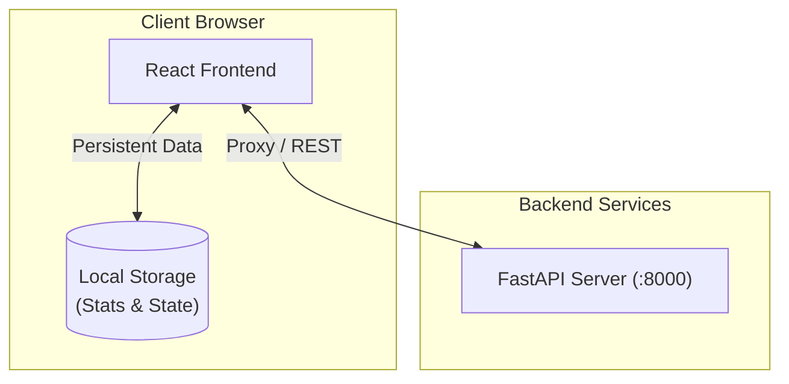

# Codele

**Daily coding game inspired by Wordle and Leetle** — A React-based web application where players solve daily coding challenges in Python using a browser-integrated editor.

The frontend communicates with a [FastAPI backend](https://github.com/watsonml/codele-backend) to fetch daily problems and record results, while maintaining player statistics and game state in local storage.

---

## Table of Contents

- [Architecture Overview](#architecture-overview)
- [Tech Stack](#tech-stack)
- [Prerequisites](#prerequisites)
- [Installation](#installation)
- [Configuration](#configuration)
- [Running the App](#running-the-app)
- [Features](#features)
- [Project Structure](#project-structure)

---

## Architecture Overview



The frontend follows a service-oriented architecture, separating API interaction and local storage logic into dedicated service modules.

---

## Tech Stack

| Layer | Technology |
|-------|-----------|
| **Framework** | [React 18](https://reactjs.org/) |
| **Build Tool** | [Vite](https://vitejs.dev/) |
| **Styling** | [Tailwind CSS](https://tailwindcss.com/) (CDN) |
| **Editor** | [Monaco Editor](https://microsoft.github.io/monaco-editor/) |
| **Icons** | [Lucide React](https://lucide.dev/) |
| **Routing** | [React Router 6](https://reactrouter.com/) |
| **Language** | [TypeScript](https://www.typescriptlang.org/) |

---

## Prerequisites

- **Node.js** (v18 or higher recommended)
- **npm** or **yarn**
- **Codele Backend** running at `http://localhost:8000` (for data fetching)

---

## Installation

1. **Clone the repository:**

   ```bash
   git clone <repository-url>
   cd Codele
   ```

2. **Install dependencies:**

   ```bash
   npm install
   ```

3. **Set up environment variables:**

   ```bash
   cp .env.example .env
   ```

   Edit `.env` if your backend is running on a different host/port:

   ```env
   VITE_API_BASE_URL=http://localhost:8000/api/v1
   ```

---

## Configuration

The application uses Vite environment variables. The primary configuration point is the `.env` file, which sets the `VITE_API_BASE_URL`.

---

## Running the App

### Development Server

```bash
npm run dev
```

The app will be available at [http://localhost:5173](http://localhost:5173).

### Production Build

```bash
npm run build
npm run preview
```

---

## Features

### 1. Daily Challenge
- Fetches a unique coding problem every day.
- Monaco Editor integration for a full IDE-like experience (syntax highlighting, indentation).
- Real-time test result feedback via the Result Matrix.

### 2. Archive View
- Browse past coding challenges.
- Visual calendar interface with theme highlighing.
- Track which problems have been solved vs. unsolved.

### 3. Persistent Statistics
- Tracks win streaks, win counts, and win distribution (number of attempts).
- Saves game progress (code and attempts) locally, allowing players to resume later.
- Data is stored in `localStorage` under the `codele_` prefix.

### 4. Interactive UI
- Dark-mode first design with a premium, sleek aesthetic.
- Responsive layout for both desktop and mobile views.
- Smooth transitions and micro-animations for feedback.

---

## Project Structure

```
Codele/
├── public/              # Static assets
├── components/          # React components
│   ├── CodeleGame.tsx   # Main game logic and UI
│   ├── ArchiveView.tsx  # Calendar and theme visualization
│   ├── CodeEditor.tsx   # Monaco Editor wrapper
│   └── ResultMatrix.tsx # Attempt status grid
├── services/            # Business logic / side effects
│   ├── ProblemService.ts # API communication
│   └── StorageService.ts # LocalStorage management
├── App.tsx              # Main routing and layout
├── index.tsx            # Application entry point
├── types.ts             # Global TypeScript interfaces
├── constants.ts         # Shared configuration (e.g. MAX_ATTEMPTS)
├── vite.config.ts       # Vite configuration
└── package.json         # Project dependencies and scripts
```

---

## License

This project is proprietary. All rights reserved.
